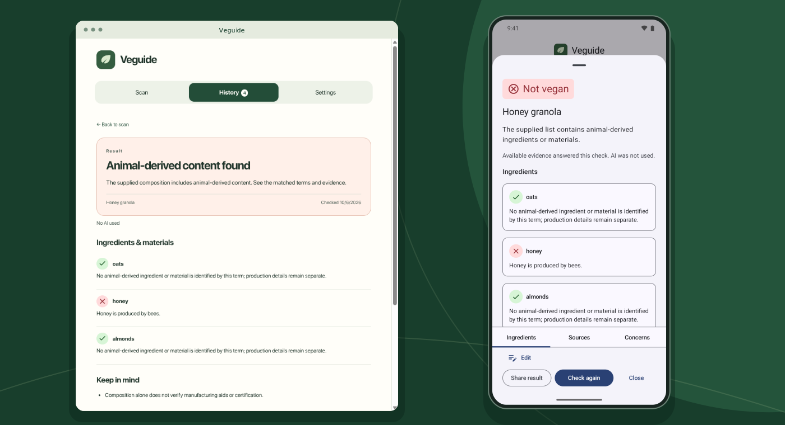
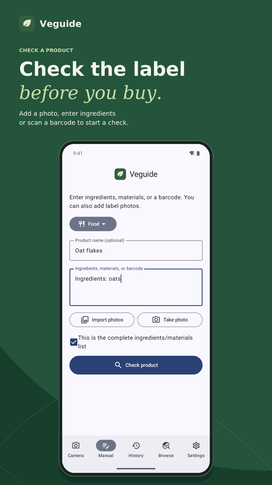
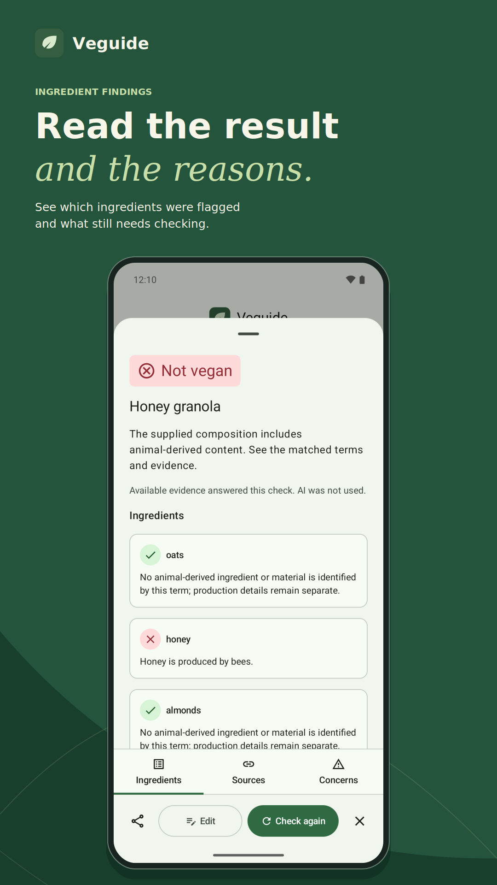
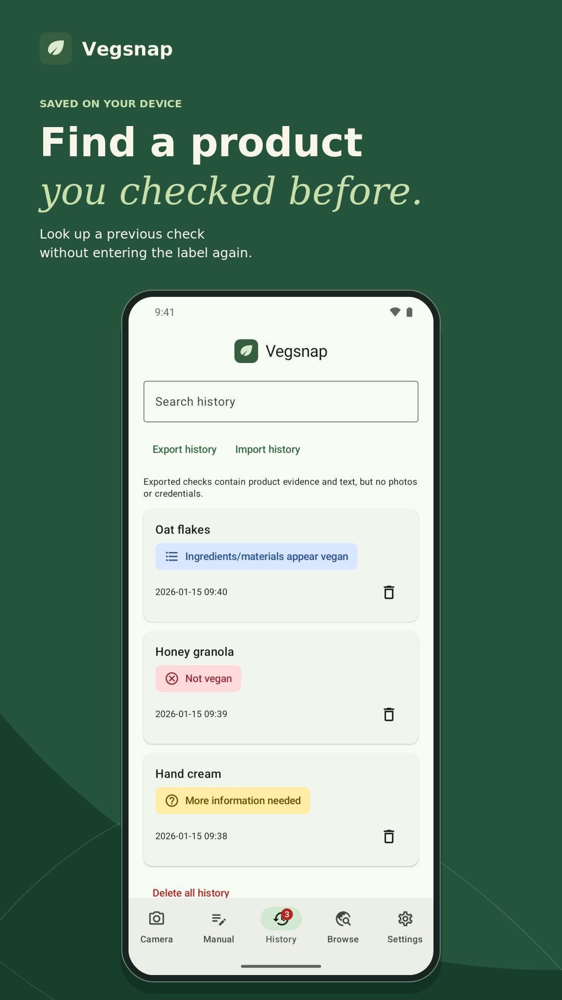
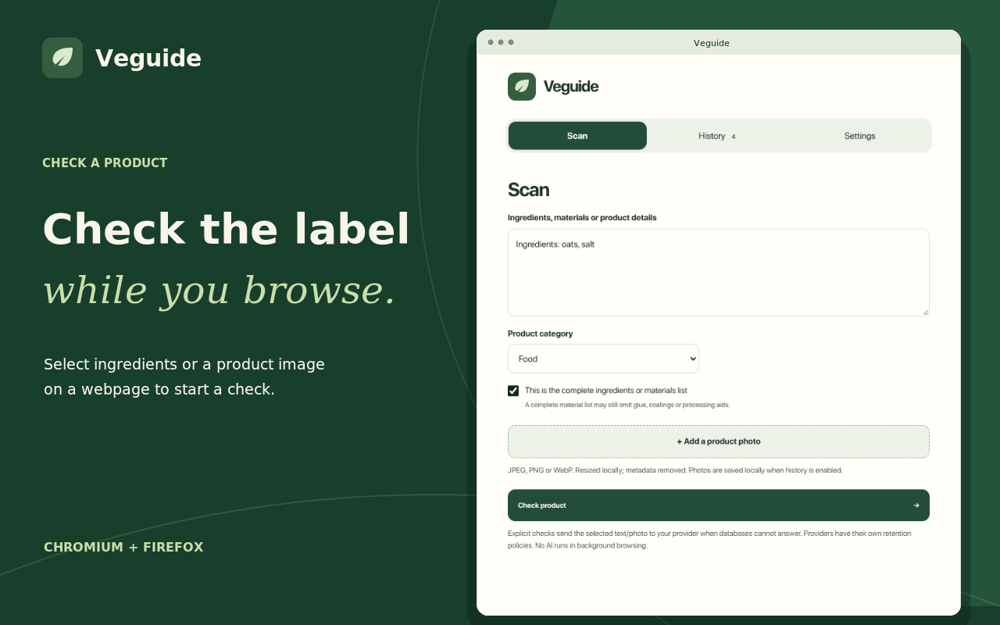
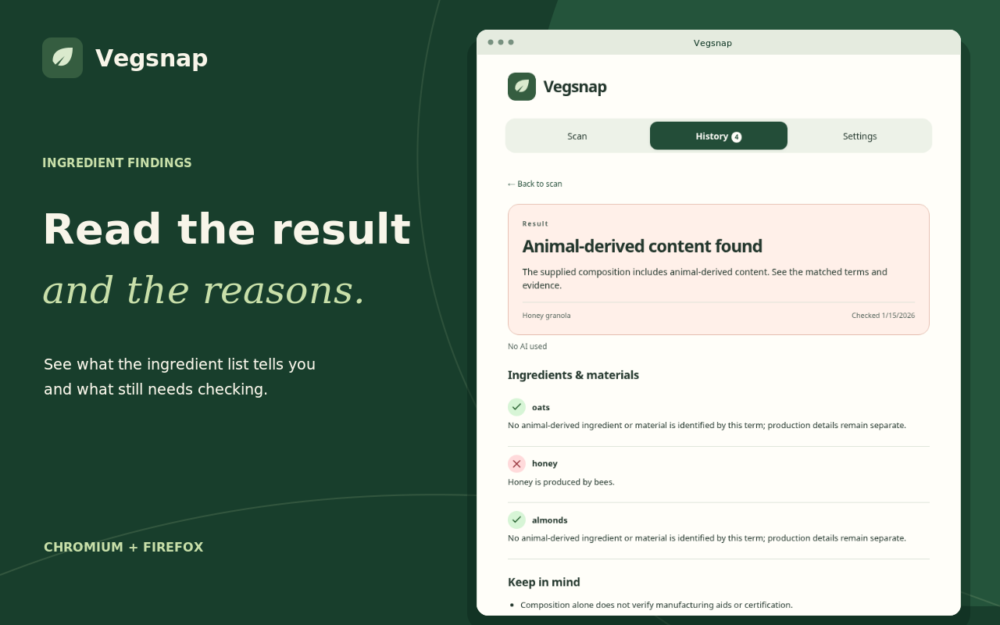
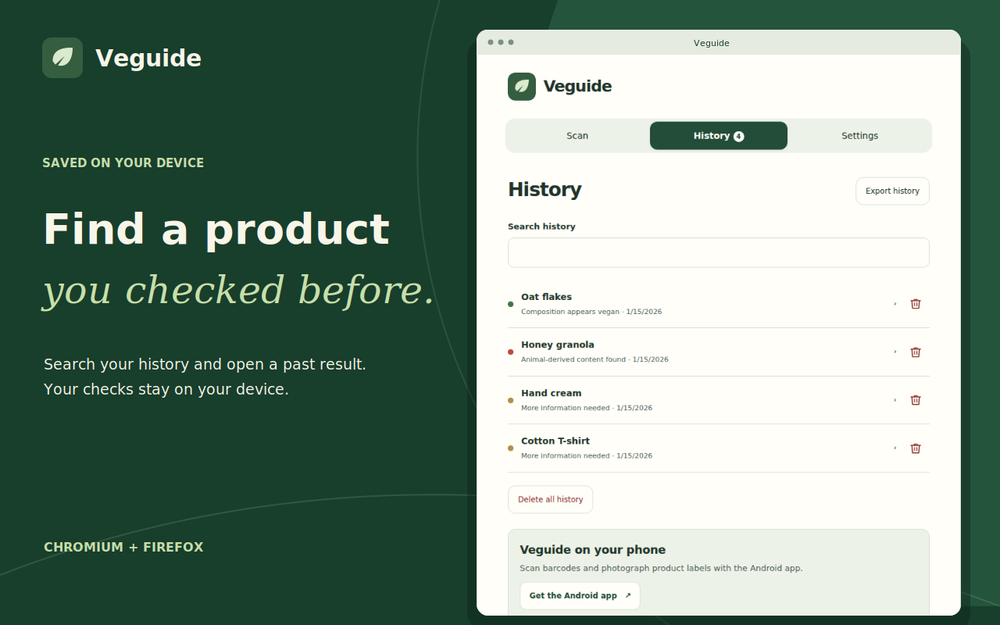

<div align="center">
  <picture></picture>
  <h1>Vegsnap</h1>
  <p><strong>Check whether a product appears vegan.</strong></p>
  <p>Photograph a label on Android, or check ingredients and product images in Chromium or Firefox.</p>
  <p>
    <picture></picture>
    &nbsp;&nbsp;
    <picture></picture>
    &nbsp;&nbsp;
    <picture></picture>
  </p>
  <p><picture><source media="(prefers-color-scheme: dark)" srcset="website/images/dark/readme-preview.png"></picture></p>
  <p>
    <a href="https://vegsnap.app"></a>
    <a href="https://github.com/D3SOX/vegsnap/releases/latest"></a>
    <a href="https://play.google.com/apps/testing/app.vegsnap"></a>
    <br>
    <a href="#install-the-browser-extension"></a>
    <a href="https://apps.obtainium.imranr.dev/redirect?r=obtainium%3A%2F%2Fapp%2F%257B%2522id%2522%253A%2522app.vegsnap%2522%252C%2522url%2522%253A%2522https%253A%252F%252Fgithub.com%252FD3SOX%252Fvegsnap%2522%252C%2522author%2522%253A%2522D3SOX%2522%252C%2522name%2522%253A%2522Vegsnap%2522%257D"></a>
  </p>
  <p><a href="https://chromewebstore.google.com/detail/vegsnap/pkkfmbgdbdoccbdngnbfpjjhpldmphej"></a></p>
</div>

Vegsnap supports food, cosmetics, household products, clothing and shoes. It uses public product databases, local ingredient and material rules, and optional AI. Results show the evidence and explain which details are missing.

You do not need a Vegsnap account. History stays on your device. The app has no ads or telemetry.

The optional [community manufacturer-reply service](packages/community/README.md) accepts redacted responses for review and publishes approved contributions on Cloudflare. It is configured separately; opening a product result does not upload its history or alter its verdict.

This is an early release. Device, store and provider compatibility tests are ongoing.


## What it does

- On Android, take or import photos, share a product, or enter text. The app has local history and offline text recognition with downloadable language models.
- In Chromium and Firefox, check selected text or right-click a product image. Enable store integrations if you want database checks while browsing. Background checks never use AI.
- Connect ChatGPT with a Plus or Pro plan, an OpenAI-compatible API, or a compatible local model for AI checks. The extension needs the optional desktop companion for ChatGPT sign-in. API-key connections work without it.
- Look up barcodes in Open Food Facts, Open Beauty Facts and Open Products Facts. Regional packs provide a selection of these records offline.
- Review company concerns alongside the product result. A reviewed list records documented animal testing, opposition to animal-welfare protections and other animal exploitation. Each entry has a source, a review date and a status. Parent-company links need their own ownership source. Selling animal products alone does not qualify.

Connected AI can also assess a company using searched sources. Its assessment stays separate from reviewed records and can be inconclusive. Neither changes the product's vegan result. A missing record or no concerns found is not an ethical endorsement.

German and English are supported, with Germany and the EU as the first markets. A native iOS app is planned.

## Screenshots

### Android

<p align="center">
  <a href="website/images/screenshots/android-check.png"><picture><source media="(prefers-color-scheme: dark)" srcset="website/images/dark/store/android/check-portrait.png"></picture></a>
  <a href="website/images/screenshots/android-result.png"><picture><source media="(prefers-color-scheme: dark)" srcset="website/images/dark/store/android/result-portrait.png"></picture></a>
  <a href="website/images/screenshots/android-history.png"><picture><source media="(prefers-color-scheme: dark)" srcset="website/images/dark/store/android/history-portrait.png"></picture></a>
</p>

### Browser extension

<p align="center">
  <a href="website/images/screenshots/extension-check.png"><picture><source media="(prefers-color-scheme: dark)" srcset="website/images/dark/store/extension/check.png"></picture></a>
</p>
<p align="center">
  <a href="website/images/screenshots/extension-result.png"><picture><source media="(prefers-color-scheme: dark)" srcset="website/images/dark/store/extension/result.png"></picture></a>
  <a href="website/images/screenshots/extension-history.png"><picture><source media="(prefers-color-scheme: dark)" srcset="website/images/dark/store/extension/history.png"></picture></a>
</p>

Open an image to see the original screenshot.

## AI and evidence

ChatGPT sign-in on Android and in the browser extension requires a **[ChatGPT Plus or Pro plan](https://developers.openai.com/siwc/quickstart)**. Free ChatGPT accounts are not supported for this connection. Public database checks and local rules work without a ChatGPT plan.

AI can identify a product, read its label and assess unfamiliar ingredients. ChatGPT and the official OpenAI API can also search for manufacturer and certification sources. Other compatible endpoints currently do not support web search.

Vegsnap accepts a web claim only if its URL came from the search tool and its product and brand match the check. AI-read labels and claims remain marked unverified. Community database labels do not establish verified certification.

Incomplete composition, ambiguous ingredient origins or conflicting sources can produce an uncertain result. Store badges require an exact barcode in the page's structured product data. Use a right-click check when a listing does not supply one.

Connecting a cloud provider can send selected text and photos to that provider when you start a check. The provider's retention policy, usage limits and charges apply. Database checks and local rules need no AI account.

## Install the Android app

Download the signed APK using the Android badge above. You can also use the Obtainium badge to track updates.

To join the Google Play closed test, first [join the Vegsnap testers group](https://groups.google.com/g/vegsnap-testers), then [opt in on Google Play](https://play.google.com/apps/testing/app.vegsnap) with the same Google account. Installation becomes available after Google approves the testing release. Please stay opted in for at least 14 days, try the app and send feedback via [GitHub Issues](https://github.com/D3SOX/vegsnap/issues) or using the [contact on the website](https://vegsnap.app/#play-test).

Google Play and GitHub APKs use different signing keys. To switch between them, export your history, uninstall the current app and install the other version. Import your history and reconnect your AI provider. History exports do not include photos or credentials.

## Install the browser extension

Install Vegsnap from the **[Chrome Web Store](https://chromewebstore.google.com/detail/vegsnap/pkkfmbgdbdoccbdngnbfpjjhpldmphej)** in Chrome or a compatible Chromium-based browser. Firefox store approval is still pending; you can install it temporarily using the package below.

Download the browser packages from the [latest release](https://github.com/D3SOX/vegsnap/releases/latest).

- Chromium: extract `vegsnap-chromium.zip`, open `chrome://extensions`, enable developer mode and choose **Load unpacked**. Select the extracted folder. The release also includes `vegsnap-chromium.crx`, but some browsers restrict direct CRX installation. The ZIP works for development installation.
- Firefox: download `vegsnap-firefox.xpi`, open `about:debugging`, choose **This Firefox**, then **Load Temporary Add-on** and select the file. The XPI is currently unsigned, so normal Firefox cannot install it permanently. Temporary add-ons disappear when Firefox closes. Permanent installation needs Mozilla signing.

## Install the ChatGPT companion

ChatGPT sign-in requires a ChatGPT Plus or Pro plan. The extension also needs a desktop companion. API-key connections do not need it. The companion saves credentials in your operating system's credential store.

The commands below use the Chrome Web Store extension ID. If you installed the Chromium ZIP or CRX manually, replace `pkkfmbgdbdoccbdngnbfpjjhpldmphej` with `bljmddjdbglldnbdhdfdlbilieoheend`.

Download the archive for your computer from the [latest release](https://github.com/D3SOX/vegsnap/releases/latest). Registration requires Python 3. Install the files in a permanent location before running `install.py`.

### Linux x86_64

Download `vegsnap-companion-linux-x86_64.tar.gz`, then run:

```sh
mkdir -p ~/.local/lib/vegsnap
tar -xzf ~/Downloads/vegsnap-companion-linux-x86_64.tar.gz -C ~/.local/lib/vegsnap
chmod +x ~/.local/lib/vegsnap/vegsnap-companion
python3 ~/.local/lib/vegsnap/install.py \
  --binary "$HOME/.local/lib/vegsnap/vegsnap-companion" \
  --browser firefox --extension-id vegsnap@vegsnap.app
```

For Chromium:

```sh
python3 "$HOME/.local/lib/vegsnap/install.py" \
  --binary "$HOME/.local/lib/vegsnap/vegsnap-companion" \
  --browser chromium --extension-id pkkfmbgdbdoccbdngnbfpjjhpldmphej
```

For Google Chrome:

```sh
python3 "$HOME/.local/lib/vegsnap/install.py" \
  --binary "$HOME/.local/lib/vegsnap/vegsnap-companion" \
  --browser chrome --extension-id pkkfmbgdbdoccbdngnbfpjjhpldmphej
```

Linux needs an unlocked Secret Service wallet, such as KDE Wallet with Secret Service enabled.

### macOS, Apple silicon and Intel

Download `vegsnap-companion-macos-universal.tar.gz`, then run:

```sh
mkdir -p "$HOME/Library/Application Support/Vegsnap"
tar -xzf ~/Downloads/vegsnap-companion-macos-universal.tar.gz \
  -C "$HOME/Library/Application Support/Vegsnap"
chmod +x "$HOME/Library/Application Support/Vegsnap/vegsnap-companion"
python3 "$HOME/Library/Application Support/Vegsnap/install.py" \
  --binary "$HOME/Library/Application Support/Vegsnap/vegsnap-companion" \
  --browser firefox --extension-id vegsnap@vegsnap.app
```

For Chromium:

```sh
python3 "$HOME/Library/Application Support/Vegsnap/install.py" \
  --binary "$HOME/Library/Application Support/Vegsnap/vegsnap-companion" \
  --browser chromium --extension-id pkkfmbgdbdoccbdngnbfpjjhpldmphej
```

For Google Chrome:

```sh
python3 "$HOME/Library/Application Support/Vegsnap/install.py" \
  --binary "$HOME/Library/Application Support/Vegsnap/vegsnap-companion" \
  --browser chrome --extension-id pkkfmbgdbdoccbdngnbfpjjhpldmphej
```

The companion uses macOS Keychain. The release is not notarized. If macOS blocks it, review the downloaded executable in System Settings under Privacy & Security.

### Windows x86_64

Download `vegsnap-companion-windows-x86_64.zip`. Install Python 3 and the [Microsoft Visual C++ v14 Redistributable for x64](https://learn.microsoft.com/en-us/cpp/windows/latest-supported-vc-redist/), then run these commands in PowerShell:

```powershell
$vegsnapDirectory = Join-Path $env:LOCALAPPDATA "Vegsnap\Companion"
New-Item -ItemType Directory -Force -Path $vegsnapDirectory | Out-Null
Expand-Archive -Force -Path "$HOME\Downloads\vegsnap-companion-windows-x86_64.zip" -DestinationPath $vegsnapDirectory
py -3 "$vegsnapDirectory\install.py" `
  --binary "$vegsnapDirectory\vegsnap-companion.exe" `
  --browser firefox --extension-id vegsnap@vegsnap.app
```

For Chromium:

```powershell
py -3 "$vegsnapDirectory\install.py" `
  --binary "$vegsnapDirectory\vegsnap-companion.exe" `
  --browser chromium --extension-id pkkfmbgdbdoccbdngnbfpjjhpldmphej
```

For Google Chrome:

```powershell
py -3 "$vegsnapDirectory\install.py" `
  --binary "$vegsnapDirectory\vegsnap-companion.exe" `
  --browser chrome --extension-id pkkfmbgdbdoccbdngnbfpjjhpldmphej
```

The installer writes a separate manifest for each browser under `%LOCALAPPDATA%\Vegsnap\NativeMessagingHosts` and registers it under `HKEY_CURRENT_USER`. It does not need administrator access. Credentials use Windows Credential Manager.

### Connect your browser

Run the registration command for each browser you use. The Chrome Web Store version uses `pkkfmbgdbdoccbdngnbfpjjhpldmphej`. Manually installed ZIP and CRX release packages use `bljmddjdbglldnbdhdfdlbilieoheend`. Both IDs stay the same across updates. Firefox uses `vegsnap@vegsnap.app`.

After registration, open the extension's settings, choose **Connect ChatGPT** and allow the native-messaging permission. Complete sign-in in the browser. Keep the companion in its registered location. If you move it, run the installer again with the new path.

## Data licenses

The application code uses AGPL-3.0-only. Open Food Facts, Open Beauty Facts and Open Products Facts databases use ODbL-1.0, with individual contents under DBCL-1.0. Regional packs retain source URLs and dates. These data licenses are separate from the application license.

Third-party dependencies, language models and certification marks retain their own licenses and terms.
